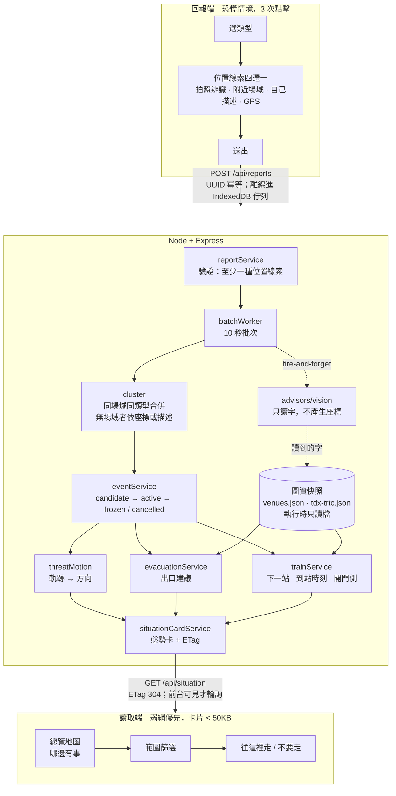

# NearPulse

地下場域的災情通報與疏散導引。沒有 GPS、沒有網路、不知道自己在哪，也要能通報與逃生。

---

## 問題與目標

台北捷運 11 年內發生過 5 起攻擊事件。2014 年那一起發生在行駛中的板南線列車上，
從發車到停妥開門，車廂內的人被關在封閉空間約 4 分鐘，而下一站的月台毫無準備。
2025 年那起攻擊則從台北車站的地下連通道移動到中山站，再到誠品生活南西店。

這些場域有三個技術條件，讓現有的通報 App 幾乎都用不上：

- 沒有 GPS。地下拿不到定位是常態，不是故障。
- 網路壅塞。事件發生時，同一個站體裡數百人同時上網。
- 沒有背景執行。網頁平台不能常駐，而沒有人會為了「可能用到」每天開著一個 App。

目標使用者是任何帶著手機、身處地下空間的一般人，不是受過訓練的站務人員，
也不預期他認得這個地方。我們希望把「發現異常」到「附近的人知道並開始移動」
之間的時間，從仰賴廣播系統的數分鐘縮短到數十秒。

整個專案有兩條貫穿的原則：位置不是通報的前提，AI 不在關鍵路徑上。

---

## 核心功能

**地下視覺定位。** 地下沒有 GPS，但有站名牌和出口編號牌，那就是地下的地標系統。
拍張照，用九宮格指出牌子在哪一格，系統從原圖裁那一格放大辨識，
讀到的字再經 OSM／TDX 圖資查表，得出場域、出口與座標。AI 只讀字，不產生座標。

**移動威脅追蹤。** 無差別攻擊的加害者會移動，單點通報有可能把人往危險推。
多位獨立目擊者在不同時間、不同出口的指認構成軌跡，據此推算方向，
讓疏散建議避開威脅前進的方向。同一個人的兩個點不算移動證據，這是為了防誤判。

**行進中列車的到站預告。** 用 TDX 官方站序與行車秒數算出下一站與到站時刻，
並通知該站月台「事故列車即將進站，請讓開車門動線」。
車廂裡的人做不了什麼，能改變結果的是月台上那群人。

**無障礙疏散。** TDX 資料顯示北捷 437 個出口中僅 14 個（3.2%）有電梯且無樓梯。
火災時電梯不可使用，所以對輪椅使用者，正確答案往往是待援而不是往出口走。
系統會給出這個答案，而不是套用一般疏散文案。

**兩段式現場確認。** 只有在場者的回覆計入門檻，在場者的「沒看到」可以主動否決
一則通報。這是對抗誤報與惡意通報的機制。

**離線可用。** Service Worker 快取殼與態勢卡，送不出去的回報存進 IndexedDB，
恢復連線後自動補送（以 client 產生的 UUID 冪等去重）。

---

## 系統架構



AI 只出現在 `advisors/vision.js`：把照片裡的字讀出來。位置由 `venueService`
拿那些字做查表得出。所有失敗路徑（逾時、無金鑰、供應商不存在、超過限流）
都回相同的降級形狀，呼叫端無從分辨，所以 AI 不可能擋住通報。
`server/test/e2e.sh` 的 123 項檢查就是在無任何 API 金鑰的環境下驗證這件事。

---

## 使用技術

| 類型 | 技術 | 用途 |
|---|---|---|
| AI 模型 | MiniMaxAI/MiniMax-M3（GMI Cloud） | 視覺辨識，兩段式（定位九宮格 → 讀取該格文字）。實測 locate 1.9s／read 1.8s。供應商可插拔，缺金鑰時自動降級 |
| 前端 | React 18 + Vite | PWA、hash 路由，無狀態管理套件 |
| 前端 | Leaflet + OSM 官方圖磚 | 總覽地圖與事件地圖，動態載入不進主 bundle |
| 前端 | Web Speech API | 語音播報與語音輸入，零 API 零金鑰 |
| 前端 | Service Worker + IndexedDB | 離線殼、態勢卡快取、回報佇列 |
| 後端 | Node 22 + Express 4 | 唯一的執行時相依套件 |
| 後端 | 記憶體 store（介面化） | 重啟即清；換 Redis／Postgres 只需替換實作 |
| 資料 | OpenStreetMap（Geofabrik PBF） | 836 個地下場域、1356 個出口，本機解析 |
| 資料 | 交通部 TDX | 北捷官方出口設施、站間行車秒數、有方向站序 |
| 資料 | 政府資料開放平臺 128416 | 逐站開門側、輪椅席車廂 |
| 資料 | OSM Nominatim | 圖資外地點的搜尋後備（唯一的執行時連外，且只在搜尋路徑） |

---

## 安裝與執行

```bash
git clone https://github.com/FanYueee/NearPulse.git && cd NearPulse

# 建置前端
cd client && npm install && npm run build

# 啟動後端（:3000，同時服務 API 與前端靜態檔）
cd ../server && npm install && npm start
```

打開 http://localhost:3000 ，`/` 是回報頁，`#/situation` 是目前狀況，
`#/confirm` 是協助確認。

以上不需要任何 API 金鑰即可完整運作。視覺辨識是選配，要啟用的話：

```bash
GMI_API_KEY=<your-key> VISION_PROVIDER=gmi VISION_MODEL=MiniMaxAI/MiniMax-M3 npm start
```

金鑰也可以放在 repo 外的檔案，重啟就不會忘了帶（需要 Node 22 以上）：

```bash
node --env-file=/path/to/nearpulse.env src/index.js
```

啟動日誌會印出「視覺辨識 啟用（interactive）」或「未啟用」，
一眼就知道設定有沒有生效。

端到端驗證（123 項，同樣不需要金鑰）：

```bash
bash server/test/e2e.sh
```

---

## 作品展示

- Demo：https://h.402673.xyz
- 評審影片：（待補）

---

## 已知限制

**圖資覆蓋不完整。** 836 個場域中有出口圖資的只有 279 個，百貨只有 58 個且多數
在關西。OSM 對台灣室內空間幾乎沒有 mapping。我們的因應方式不是等圖資變好，
而是讓系統在圖資缺席時仍然可用：通報照樣成立，只有「往哪個出口走」這一層
會誠實地說給不出來。

**給不出「第幾節車廂離樓梯近」。** 這個功能日本的乗換案內有，但那是向
株式会社ナビット購買的人工實地調查資料（ジョルダン 2022-09-30 新聞稿明載），
不是開放資料。ODPT、TDX 都沒有；OSM 的 `railway:platform:section` 全球 3098 筆、
約 91% 在德語區，台日皆 0。台北捷運Go 有此功能但資料未開放。
我們改以開門側替代，那是官方逐站資料，而且不需要知道車廂編號就能執行。

**不顯示公尺數。** 地下通道的實際步行距離與地面直線距離可以差上兩三倍，
講「約 91m」是假精確。到站秒數是唯一的例外，因為那有 TDX 官方行車時間支撐，
而且刻意取整到 10 秒或半分鐘。

**語音輸入依賴網路。** Chrome 的 `SpeechRecognition` 會把音訊送到 Google 伺服器，
所以它是加速器而非必經路徑，不支援或失敗時會靜默回到打字。


---

## 第三方服務、資料與素材

| 項目 | 來源 | 授權 |
|---|---|---|
| `server/src/data/venues.json` | OpenStreetMap（Geofabrik 抽取檔，本機解析） | ODbL，© OpenStreetMap contributors |
| 底圖圖磚 | `tile.openstreetmap.org` | ODbL；依 OSM Tile Usage Policy，僅供開發與展示 |
| 地點搜尋後備 | OpenStreetMap Nominatim | ODbL；遵守每秒 1 次與 User-Agent 規範 |
| `server/src/data/tdx-trtc.json` | 交通部運輸資料流通服務平臺（TDX） | 依 TDX 開放資料條款 |
| `server/src/data/trtc-open.json` | 政府資料開放平臺 [dataset 128416](https://data.gov.tw/dataset/128416) | 政府資料開放授權條款第 1 版 |
| 視覺辨識 | GMI Cloud（MiniMaxAI/MiniMax-M3） | 依供應商條款 |
| React 18 / Vite / Express 4 / Leaflet | npm | MIT / BSD-2 |

本專案不含任何金鑰、token 或個人資料。所有 API 金鑰透過環境變數提供，
未寫入任何進版控的檔案。使用者資料只存在 sessionStorage，關頁即滅；
唯一寫入 localStorage 的是「下樓前的最後定位」，座標粗化到約 110 公尺網格、
30 分鐘自動失效、不含識別碼。現場照片暫存 10 分鐘後失效。

---

## License

MIT，見 [`LICENSE`](LICENSE)。

`venues.json` 是 OpenStreetMap 的 ODbL 衍生資料庫，使用時需保留姓名標示。
